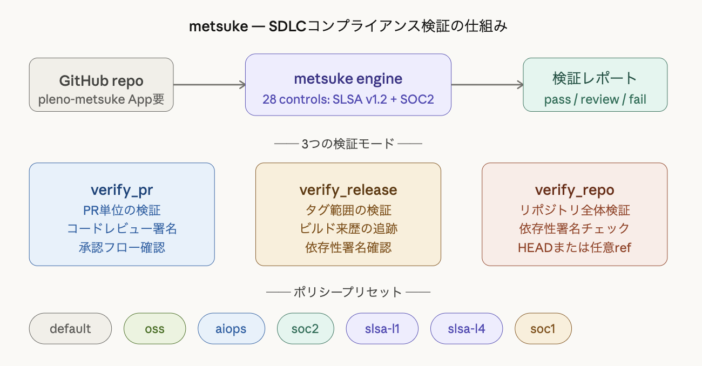

# Metsuke (目付)

SDLC process inspector — Remote MCP Server + GitHub App powered by [libverify](https://github.com/HikaruEgashira/libverify).

## What is Metsuke?

Metsuke is a Remote MCP Server that provides SDLC compliance verification as tools that AI agents (Claude Code, etc.) can invoke. Named after the Edo-period inspector officials (目付), it continuously monitors and evaluates your organization's development processes.



## Features

- 28 SDLC Controls: SLSA v1.2 (Source/Build/Dependencies) + SOC2 CC7/CC8
- 9 Policy Presets: default, oss, aiops, soc1, soc2, slsa-l1 through slsa-l4
- GitHub App: [Install on your org](https://github.com/apps/pleno-metsuke)
- MCP Tools
- Agent Skills

## Connect

Remote MCP Server
```
https://metsuke.plenoai.com/mcp
```

Claude Code (`~/.claude/settings.json`)
```json
{
  "mcpServers": {
    "metsuke": {
      "type": "url",
      "url": "https://metsuke.plenoai.com/mcp"
    }
  }
}
```

Agent Skills
```bash
npx skills add plenoai/metsuke
```

## GitHub App

Install: https://github.com/apps/pleno-metsuke

## Build

```bash
cargo build --release
nix build .#default     # binary
nix build .#docker      # Docker image
docker build -t metsuke .
```

## License

MIT
